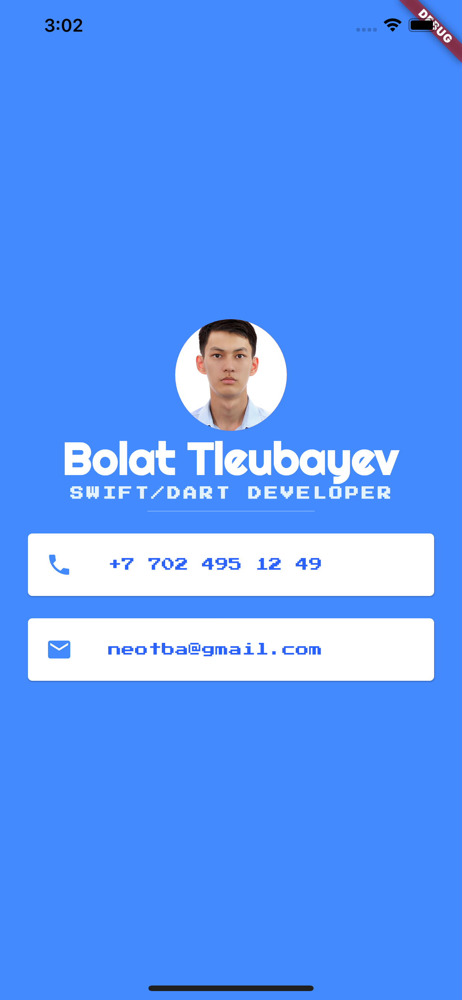

# Mi Card

## About

This app is aimed to show the contact info of a person, it was done according to the tutorial by Angela Yu.

This is a simple Flutter App that utilizes several concepts:

* Stateless Widgets
* Containers
* Columns and Rows
* Custom Fonts (from [Google Fonts](fonts.google.com))
* Material Icons
* Text Widgets

  

## Credits

>This is a companion project to The App Brewery's Complete Flutter Development Bootcamp, check out the full course at [www.appbrewery.co](https://www.appbrewery.co/)
